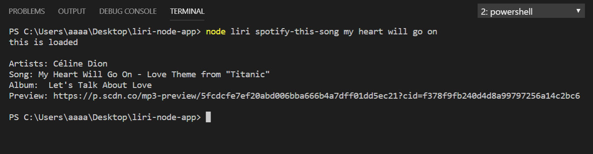

# liri-node-app
## About

LIRI is like iPhone's SIRI;however, unlike SIRI, LIRI is a (L)anguage (I)nterpretation and (R)ecognition (I)nterface. It is a command line **Node app** that takes in parameters and gives you back data.

## Functions

There are four functions built in the bot:  

        *`movie()`
        *`song()`
        *`band()`
        *`doit()`

To call any of the above functions, one has to type in its' respective parameter along with desired action. To do so, one has to navigate to the file directory in the command terminal and follow the format:
> `node liri <respective-parameter> <respective action>`

### `movie()`
--------------------------------------------
`node liri movie-this <movie title>`  
This function takes in a *movie title* and displays:  

       *Title of the movie.
       *Year the movie came out.
       *IMDB Rating of the movie.
       *Rotten Tomatoes Rating of the movie.
       *Country where the movie was produced.
       *Language of the movie.
       *Plot of the movie.
       *Actors in the movie.

It takes `movie-this` as the parameter. It uses imdb api which is called through axios package.   
*(There is no default yet!)*

### `song()`
--------------------------------
`node liri spotify-this-song <name of song>`  
This function takes in a name of a song and displays:  

     * Artist(s)
     * The song's name.
     * A preview link of the song from Spotify.
     * The album that the song is from.

It takes in `spotify-this-song` as the parameter. The function uses Node Spotify Api npm.   
*(There is no default yet!)*

### `band()`
-----------------------------------------
`node liri concert-this <artists' name>`  
This function takes in name of an artist/band and displays following info about their upcoming concerts:  

    * Name of the venue
    * Venue location
    * Date of the Event (use moment to format this as "MM/DD/YYYY")

It takes in `concert-this` as the parameter.  
*(There is no default yet!)*

### `doit()`
--------------------------------------
`node liri do-what-it-says`  
When this function is called it reads the `random.txt` file located in the directory and takes the first element as parameter and takes the second element as the input to execute the corresponding function. `fs` node package is used to read the file.

## License
**MIT** License